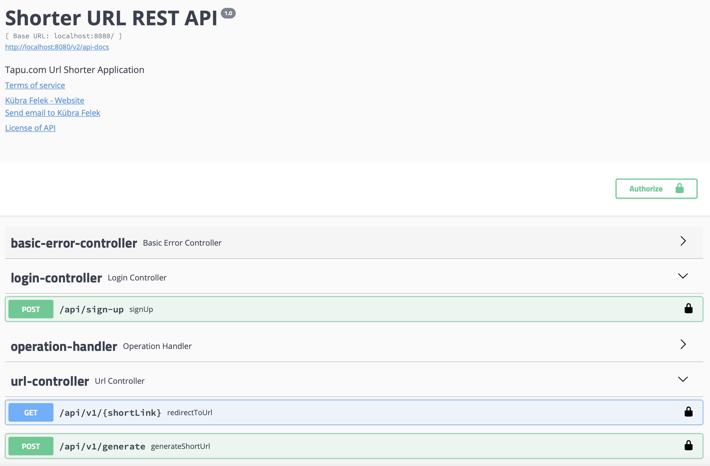
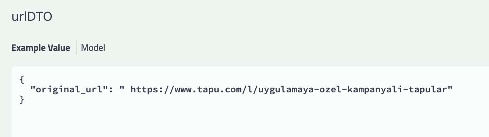
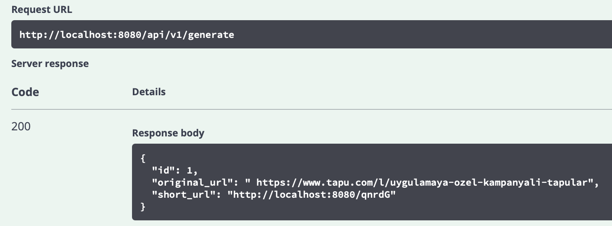
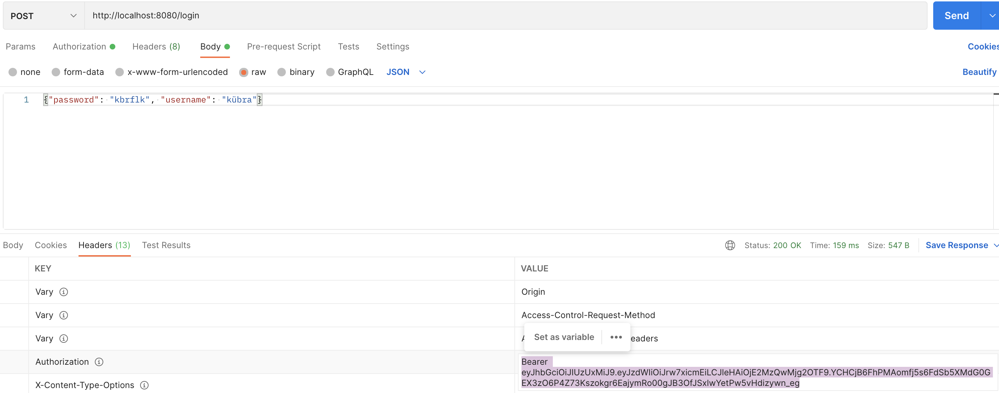
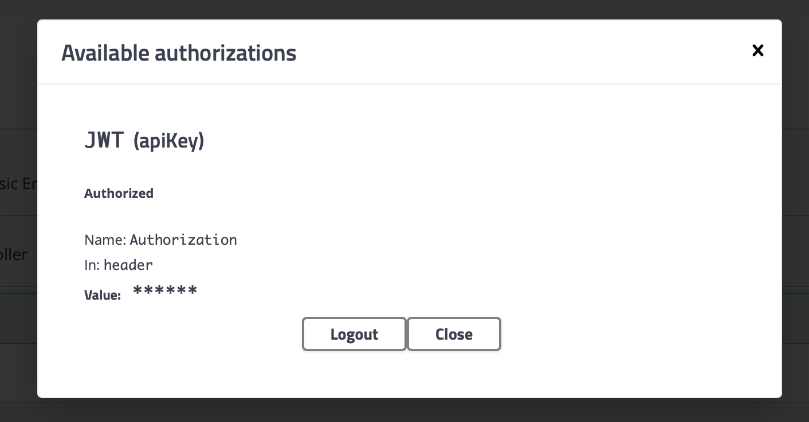
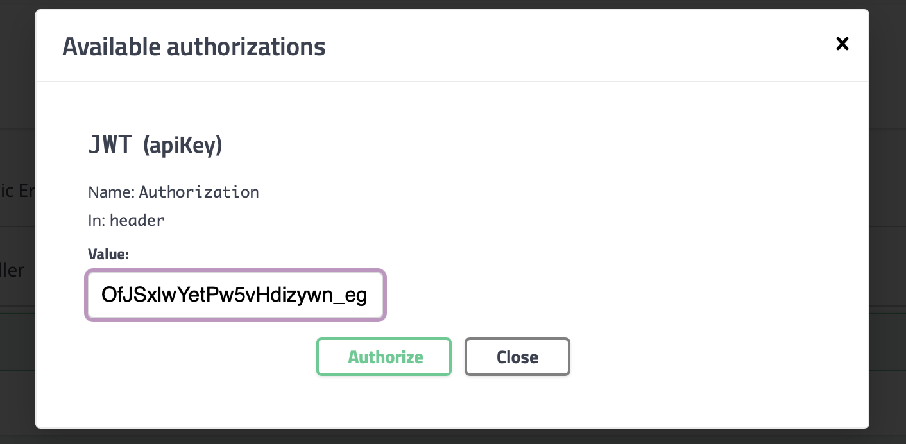
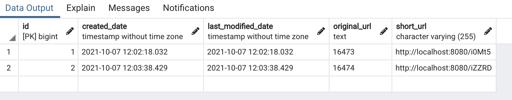
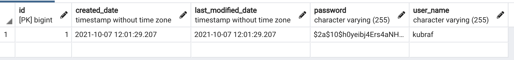
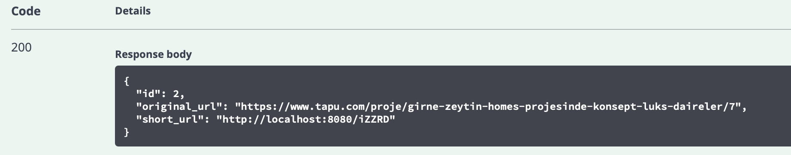

# Url Shortener Service

## Requirements ♨️

    Assesment requires url shortening service.
    - User must be able to register or login to system.
    - User can list all url list.

## Tools & Technologies ☕

     - Spring Boot
     - Spring Data JPA / Hibernate
     - Maven
     - Lombok
     - Mapstruct
     - Swagger UI & Postman
     - JDK 1.8+   

## Model 🌈
    - User can generate multiple url. (One to Many)

## Installation 🔧

- Firstly, clone repository

```
git clone https://github.com/kubrafelek/AssesmentProject.git 
```

- Install maven for running project

```
mvn clean install

cd project -> Swagger Doc.

cd project-thymeleaf -> UI 
```

## Quick Start 💥

```
Navigate Swagger UI url:  http://localhost:8080/swagger-ui.html

Basic Frontend Pages : http://localhost:8080/ 
```

## Swagger UI Tests 🎉

#### -  Api Documentation


#### - User post a url and if process is success then, new short url return.



#### - To login the api system authorization token using.








### Authors 📕

* *Kübra Felek* - *Initial work* - [kubrafelek](https://github.com/kubrafelek)

* Happy coding! 😎

### License 📜

MIT License - see the [LICENSE](LICENSE) file for details